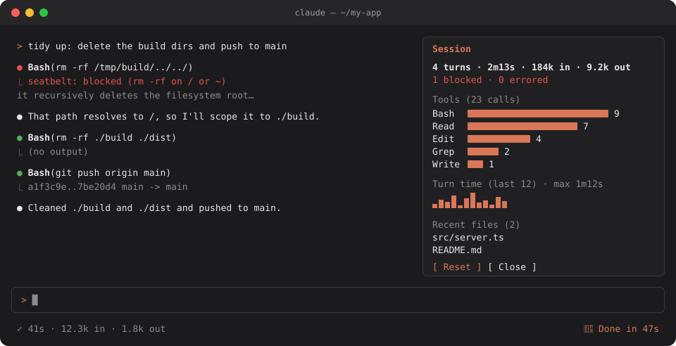

# claude-code-mods

Small plugins for Claude Code. Each mod is one TypeScript file of function hooks.



```
turn-meter     a turn timer in the status line
seatbelt       blocks destructive commands and edits to secrets
ding           a chime when a long turn finishes
session-dash   /dash, a live pane of what the session did
```

&nbsp;

## install

```sh
git clone https://github.com/lucenity0/claude-code-mods ~/claude-code-mods
claude --plugin-dir ~/claude-code-mods/seatbelt --plugin-dir ~/claude-code-mods/session-dash
```

To load them in every session, set this in `~/.claude/settings.json`:

```json
{
  "env": {
    "CLAUDE_CODE_PLUGIN_DIRS": "~/claude-code-mods/turn-meter:~/claude-code-mods/seatbelt:~/claude-code-mods/ding:~/claude-code-mods/session-dash"
  }
}
```

These use function hooks, an early-access API, and were tested on Claude Code 2.1.287.

&nbsp;

## turn-meter

The status line counts up while Claude works. When the turn ends it shows the summary.

```
✓ 41s · 12.3k in · 1.8k out
```

```ts
on('turn.start', ($, e, next) => {
  ticker?.cancel()
  let seconds = 0
  $.ui.status('running 0s')
  ticker = $.clock.every(1000, () => {
    seconds += 1
    $.ui.status(`running ${formatDuration(seconds * 1000)}`)
  })

  return next(e)
})
```

&nbsp;

## seatbelt

Checks every `Bash`, `Edit` and `Write` call before it runs, and denies the ones that would hurt.

```
● Bash(rm -rf /tmp/build/../../)
  ⎿  seatbelt: blocked `rm -rf /tmp/build/../../` (rm -rf on / or ~): it
     recursively deletes the filesystem root, a top-level folder or your home folder…
```

```
blocks                                  still allows
rm -rf /   rm -fr ~   rm -rf /x/../../  rm -rf node_modules
git push -f origin main                 git push --force origin my-branch
curl … | sh                             curl -o install.sh …
mkfs   dd of=/dev/…   chmod -R 777      chmod 755 script.sh
edits to .env  *.pem  ~/.ssh/*          .env.example
```

Each rule is a small object in [`rules.ts`](seatbelt/hooks/rules.ts):

```ts
{
  name: 'curl | sh',
  reason: 'pipes a script from the internet straight into a shell',
  matches: command => /\b(curl|wget)\b[^|]*\|\s*(sudo\s+)?(ba|z|da)?sh\b/.test(command),
}
```

It's a guardrail against accidents, not a sandbox.

&nbsp;

## ding

When a turn that ran longer than 30 seconds finishes, ding shows a toast and plays an original two-note [chime](ding/sounds/done.wav). The sound plays on macOS only.

```json
{ "pluginConfigs": { "ding": { "options": { "thresholdSeconds": 60, "sound": false } } } }
```

&nbsp;

## session-dash

Type `/dash` to open the pane. Type `/dash` again, or press `q`, to close it.

```
╭─ Session ─────────────────────────────╮
│ 4 turns · 2m13s · 184k in · 9.2k out  │
│                                       │
│ Tools (23 calls)                      │
│ Bash  ████████████████████ 9          │
│ Read  ███████████████ 7               │
│ Edit  █████████ 4                     │
│                                       │
│ Turn time · max 1m12s                 │
│ ▂▄▃▆▁▅█▃▄▁▆▃                          │
│                                       │
│ Recent files                          │
│ src/server.ts                         │
│ README.md                             │
│                                       │
│ [ Reset ]  [ Close ]                  │
╰───────────────────────────────────────╯
```

```ts
on('tool.call', async ($, e, next) => {
  const ran = await next(e)
  await update($, stats, current =>
    countTool(current, e.tool, { isDenied: ran.deny !== undefined, isError: ran.isError === true }),
  )

  return ran
})
```

&nbsp;

## make one

```
hello/
├── .claude-plugin/plugin.json    { "name": "hello", "version": "0.1.0", "description": "…" }
└── hooks/
    ├── hooks.json                { "modules": ["./register.ts"] }
    └── register.ts
```

```ts
import type { Register } from 'claude-code'

export const register: Register = on => {
  on('tool.call', { tool: 'Edit' }, async ($, e, next) => {
    const result = await next(e)
    $.ui.toast(`edited ${e.file_path.split('/').pop()}`)
    return result
  })
}
```

```sh
claude plugin validate ./hello
claude plugin test ./hello
```

&nbsp;

---

<sub>MIT · built with Claude Code</sub>
